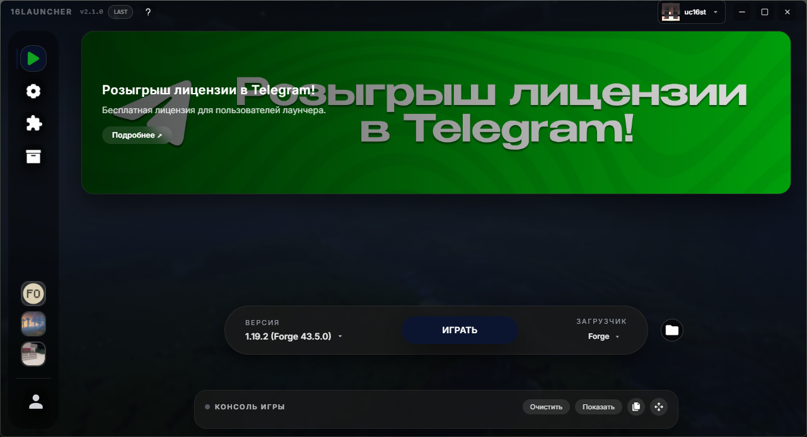
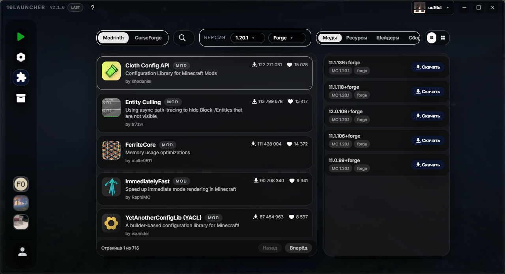
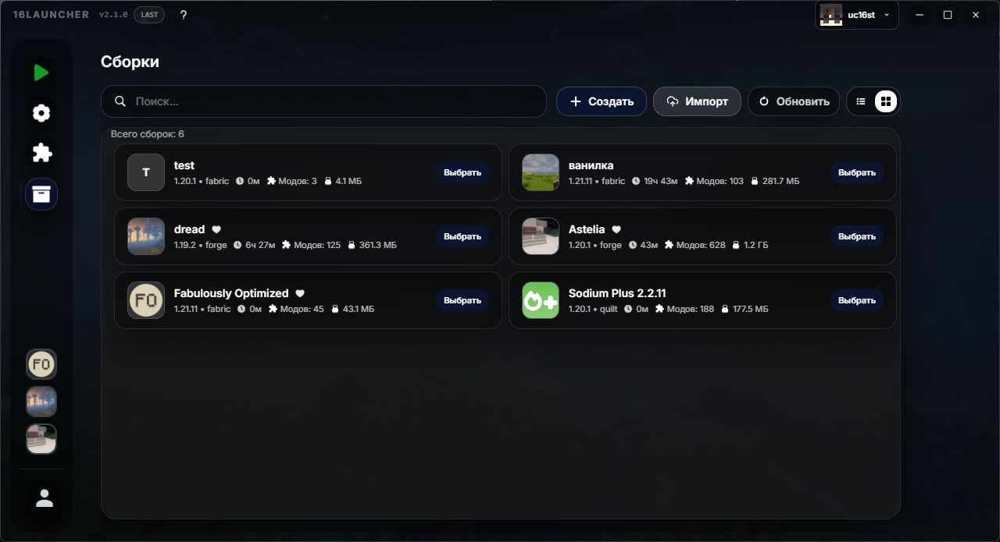
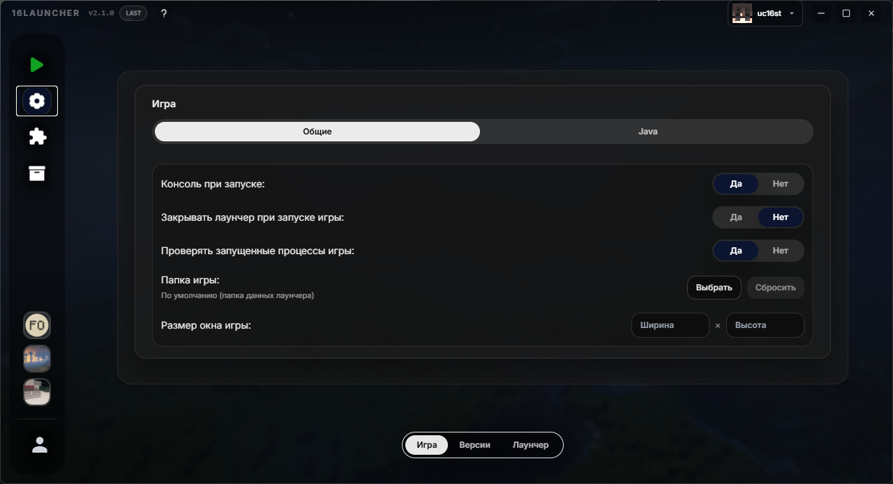
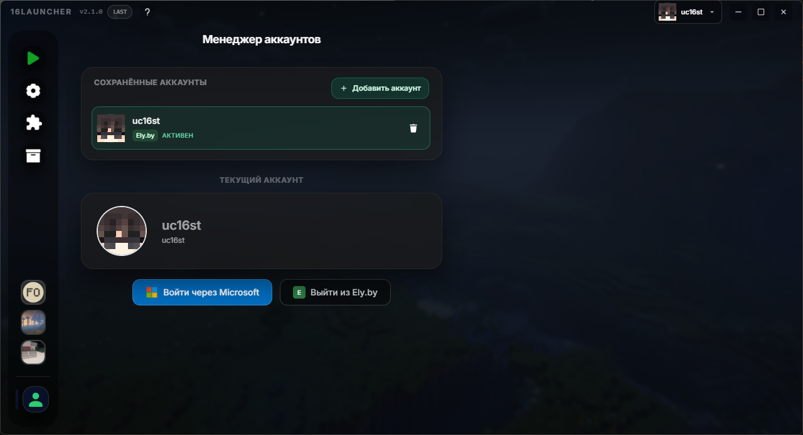

  
  <h1 align="center">16Launcher</h1>

  <em>Reliable cross-platform Minecraft launcher. Built-in mod management, advanced optimization, and clean UI. Lightweight, stable, with flexible settings for full.</em>

  
  

---

**Source Code**: [https://github.com/launcherdev11/rust-launcher](https://github.com/launcherdev11/rust-launcher)

**Website**: [https://16luncher.ru](https://16-launcher.ru)

---

---
    
**16Launcher** - Reliable cross-platform Minecraft launcher. Built-in mod management, advanced optimization, and clean UI. Lightweight, stable, with flexible settings for full.

## Installation

1. Download the latest installer from [Official website](https://16-launcher.ru)
2. Run the installer and follow the setup instructions
3. Launch 16Launcher and start playing!

## Features

- **Fast & Optimized**: Quick startup and smooth performance
- **Multi-Version Support**: Play any Minecraft version from classic to latest
- **Secure**: Regular updates and security patches
- **Mod Management**: Easy mod installation and organization

## Quick Start

1. **Download** the launcher from our [official website](https://16luncher.ru)
2. **Install** following the instructions for your operating system
3. **Select** your preferred Minecraft version
4. **Click Play** and enjoy!

# Screenshots

## Support

- Email: 16launcher@gmail.com
- Website: [https://16-launcher.ru](https://16-launcher.ru)
- Issues: [GitHub Issues](https://github.com/launcherdev11/rust-launcher/issues)

## License

This project is licensed under the terms of the GPL-3.0 license.