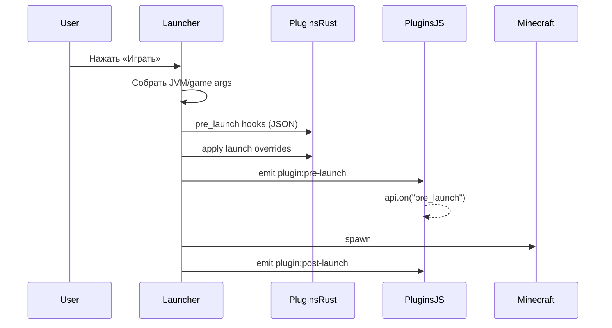

# Хуки жизненного цикла

Плагины могут реагировать на события лаунчера двумя способами:

1. **JavaScript** — `api.on("event", handler)` в `main.js`
2. **Декларативный JSON** — `hooks/pre_launch.json` (только `pre_launch`)

---

## События

### `launcher_ready`

**Когда:** после старта приложения и при перезагрузке плагинов.

**JS:**
```javascript
api.on("launcher_ready", () => {
  api.log("Лаунчер готов");
});
```

**Манифест:** добавьте `"launcher_ready"` в `hooks`.

---

### `pre_launch`

**Когда:** после сборки аргументов запуска, **непосредственно перед** `Process::spawn`.

**Порядок обработки (backend):**

1. Декларативный `hooks/pre_launch.json` (если есть разрешения)
2. Runtime overrides из `api.setLaunchOverrides()` (из JS, вызванного ранее в том же тике или при предыдущем pre_launch event)
3. Emit `plugin:pre-launch` → JS-обработчики `api.on("pre_launch")`

> **Важно:** `setLaunchOverrides` внутри обработчика `pre_launch` применяется **на следующий** запуск, т.к. Rust-часть уже завершена. Для текущего запуска используйте `hooks/pre_launch.json` или вызывайте `setLaunchOverrides` заранее (например, при нажатии «Играть» в UI плагина).

**Декларативный хук** — `hooks/pre_launch.json`:

```json
{
  "jvm_args_append": ["-Dexample=true"],
  "game_args_append": [],
  "profile_filter": ["profile-uuid-1", "profile-uuid-2"],
  "version_filter": ["1.20.1", "1.21.4"]
}
```

| Поле | Описание |
|------|----------|
| `jvm_args_append` | JVM-флаги (нужно `modify_jvm_args`) |
| `game_args_append` | Аргументы игры (нужно `modify_game_args`) |
| `profile_filter` | `null` = все профили; иначе только перечисленные ID |
| `version_filter` | `null` = все версии; иначе только перечисленные version_id |

**JS payload:**
```javascript
api.on("pre_launch", (p) => {
  // p.profileId, p.versionId, p.jvmArgs, p.gameArgs
});
```

---

### `post_launch`

**Когда:** сразу после успешного `spawn`, до стриминга консоли.

**JS payload:**
```javascript
api.on("post_launch", (p) => {
  api.log("Игра запущена, PID:", p.pid);
});
```

После этого события runtime launch overrides **сбрасываются**.

---

## Диаграмма



---

## Рекомендации

| Задача | Рекомендуемый способ |
|--------|---------------------|
| Постоянный JVM-флаг | `hooks/pre_launch.json` |
| Флаг только для одного профиля | `profile_filter` в JSON |
| Условный флаг из UI плагина | `api.setConfig` + чтение в `pre_launch` + JSON **или** override до клика «Играть» |
| Уведомление после старта | `post_launch` в JS |
| Инициализация при старте | `launcher_ready` |

---

## Заблокированные JVM-флаги

Следующие флаги **никогда** не применятся (фильтр лаунчера):

- `-agentlib:`, `-agentpath:`
- `-Xrun`, `-Xdebug`
- `-cp`, `-classpath`
- `-p`, `--module-path`
- `-Djava.library.path` (и вариант с `=`)

Это защита целостности запуска Minecraft.
